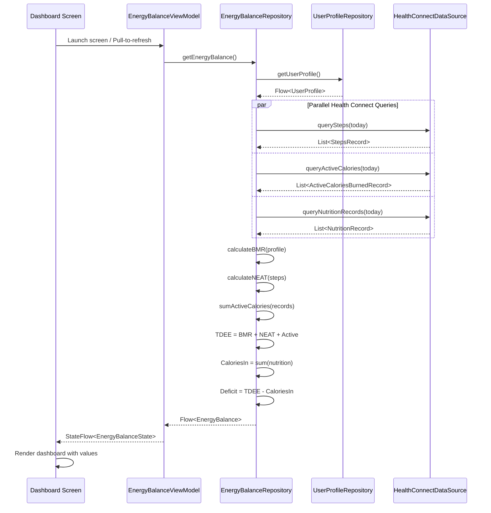

# Epic Technical Specification: Energy Balance & Caloric Deficit Tracking

Date: 2025-11-26
Author: BMad
Epic ID: 6
Status: Draft

---

## Overview

Epic 6 delivers comprehensive caloric deficit tracking by implementing scientifically grounded Total Daily Energy Expenditure (TDEE) calculations and visualizing daily Calories In vs Calories Out. This epic transforms Foodie from a simple meal logger into a complete body recomposition tool by calculating TDEE as the sum of Basal Metabolic Rate (BMR using Mifflin-St Jeor equation), Non-Exercise Activity Thermogenesis (NEAT from step counts using 0.04 kcal/step peer-reviewed formula), and Active Energy Expenditure (direct from Health Connect ActiveEnergyBurned records).

The core value proposition centres on eliminating reliance on third-party tools (MyFitnessPal, Garmin calculators) for energy balance tracking by providing fully transparent, controllable calculations with real-time TDEE updates as activity data syncs throughout the day. This epic directly addresses the primary use case stated in the PRD: sustainable body recomposition through precision nutrition tracking with complete visibility into the energy balance equation.

Epic 6 builds upon the established meal tracking foundation (Epics 1-5) by adding the "Calories Out" side of the energy equation, enabling users to track deficit/surplus with scientific accuracy using peer-reviewed formulas and Health Connect's standardized health data platform.

## Objectives and Scope

**In Scope:**
- User profile settings screen for BMR calculation inputs: sex (Male/Female), age (years), weight (kg), height (cm)
- Health Connect integration to pre-populate weight and height from existing WeightRecord and HeightRecord data
- Two-way Health Connect sync: manual weight/height entries in Foodie create new timestamped Health Connect records
- BMR calculation using Mifflin-St Jeor equation (most accurate general-population formula):
  - Males: BMR = (10 × weight_kg) + (6.25 × height_cm) - (5 × age_years) + 5
  - Females: BMR = (10 × weight_kg) + (6.25 × height_cm) - (5 × age_years) - 161
- NEAT calculation from Health Connect StepsRecord data: PassiveCalories = steps × 0.04 kcal/step
- Active energy expenditure query from Health Connect ActiveCaloriesBurnedRecord (populated by Garmin sync)
- TDEE calculation: TDEE = BMR + NEAT + Active with real-time reactive updates
- Energy Balance Dashboard screen displaying:
  - Calories In (sum of today's NutritionRecord entries)
  - Calories Out (TDEE)
  - Deficit/Surplus (Calories Out - Calories In) with colour coding (green deficit, red surplus)
  - TDEE breakdown showing BMR + Passive + Active components for transparency
- Navigation integration: Dashboard accessible from main app navigation
- Pull-to-refresh for manual data sync from Health Connect

**Out of Scope:**
- Historical trend graphs or weekly/monthly deficit aggregation (V2.0+)
- Body weight trend tracking or smart scale integration (V2.0+)
- Custom NEAT formulas or user-adjustable kcal/step multipliers (uses peer-reviewed 0.04 constant)
- Custom activity multipliers beyond Health Connect data (PAL calculations deferred)
- Meal timing categorization or circadian rhythm insights (V2.0+)
- Macro tracking integration with energy balance (Epic 7 feature)
- Goal setting or recommended deficit calculations (V2.0+)
- Notifications for deficit/surplus alerts
- Export or sharing of energy balance data

**Success Criteria:**
- BMR calculation produces values within expected ranges for user demographics (1200-2500 kcal typical)
- TDEE updates automatically when new step data or active calories sync from Garmin
- Dashboard loads in < 500ms and displays current-day data accurately
- Weight/height manual entries create verifiable Health Connect records visible in Google Fit
- Deficit/surplus calculation matches manual calculation: (BMR + NEAT + Active) - Calories In
- All 7 story acceptance criteria verified through manual testing on physical device
- Zero calculation errors or off-by-one bugs in energy balance math

## System Architecture Alignment

Epic 6 extends the established MVVM architecture with new domain logic for energy expenditure calculations while maintaining the Health Connect-as-single-source-of-truth principle from Epics 1-5. The implementation follows the proven repository pattern with reactive Flow streams for real-time TDEE updates.

**New Components:**

**EnergyBalanceRepository** (data/repository/)
- Orchestrates BMR, NEAT, and Active calculations
- Queries Health Connect for weight, height, steps, and active calories
- Exposes reactive Flow<TDEE> combining all energy components
- Handles Health Connect permission errors and missing data scenarios
- Methods:
  - `calculateBMR(sex, age, weight, height): Result<Double>`
  - `calculateNEAT(): Flow<Double>` (reacts to step data changes)
  - `getActiveCalories(): Flow<Double>` (reacts to Garmin sync)
  - `getTDEE(): Flow<Double>` (combines all components)
  - `getCaloriesIn(): Flow<Double>` (queries NutritionRecord for today)

**UserProfileRepository** (data/repository/)
- Manages user demographic data for BMR calculation
- Reads/writes weight and height to Health Connect
- Stores sex and age in SharedPreferences (not available in Health Connect)
- Pre-populates weight/height from Health Connect on first access
- Methods:
  - `getUserProfile(): Flow<UserProfile>`
  - `updateProfile(sex, age, weight, height): Result<Unit>`
  - `saveWeightToHealthConnect(weight): Result<Unit>`
  - `saveHeightToHealthConnect(height): Result<Unit>`

**HealthConnectDataSource** (data/local/healthconnect/)
- Extends existing HealthConnectManager from Epic 1
- Adds query methods for Steps, Weight, Height, ActiveCalories records
- Implements TimeRangeFilter for current-day data queries (midnight to now)
- New methods:
  - `querySteps(startTime, endTime): List<StepsRecord>`
  - `queryWeight(): WeightRecord?` (latest record)
  - `queryHeight(): HeightRecord?` (latest record)
  - `queryActiveCalories(startTime, endTime): Double` (using AggregateRequest)
  - `insertWeight(weight, timestamp): Result<Unit>`
  - `insertHeight(height, timestamp): Result<Unit>`

**Domain Models:**

```kotlin
// domain/model/UserProfile.kt
data class UserProfile(
    val sex: Sex,
    val age: Int,
    val weightKg: Double,
    val heightCm: Double
) {
    enum class Sex { MALE, FEMALE }
    
    fun validate(): Result<Unit> {
        if (age !in 13..120) return Result.Error(ValidationError("age must be 13-120"))
        if (weightKg !in 30.0..300.0) return Result.Error(ValidationError("weight must be 30-300 kg"))
        if (heightCm !in 100.0..250.0) return Result.Error(ValidationError("height must be 100-250 cm"))
        return Result.Success(Unit)
    }
}

// domain/model/EnergyBalance.kt
data class EnergyBalance(
    val bmr: Double,              // kcal/day
    val neat: Double,             // kcal from steps
    val activeCalories: Double,   // kcal from workouts
    val tdee: Double,             // BMR + NEAT + Active
    val caloriesIn: Double,       // sum of today's meals
    val deficitSurplus: Double    // TDEE - Calories In (negative = surplus)
) {
    val isDeficit: Boolean get() = deficitSurplus > 0
    val formattedDeficitSurplus: String get() = 
        if (isDeficit) "-${deficitSurplus.toInt()} kcal deficit"
        else "+${(-deficitSurplus).toInt()} kcal surplus"
}
```

**UI Layer:**

**SettingsScreen Enhancement** (ui/screens/settings/)
- Extends existing SettingsScreen from Epic 5
- Adds "User Profile" preference category with fields:
  - Sex selection (ListPreference with Male/Female options)
  - Age input (EditTextPreference with numeric validation)
  - Weight input (EditTextPreference pre-populated from Health Connect)
  - Height input (EditTextPreference pre-populated from Health Connect)
- Each field includes helper text: "Used for BMR calculation"
- Weight/Height changes trigger Health Connect write operations

**EnergyBalanceDashboardScreen** (ui/screens/energybalance/)
- New Compose screen displaying energy balance metrics
- Uses Material 3 cards for visual hierarchy
- Real-time updates via ViewModel StateFlow collection
- Pull-to-refresh triggers Health Connect re-query
- Empty state: "Log your first meal to start tracking"
- Breakdown view shows transparent formula: "BMR: X + Passive: Y + Active: Z = TDEE"

**EnergyBalanceDashboardViewModel** (ui/screens/energybalance/)
- Observes EnergyBalanceRepository reactive streams
- Combines multiple Flow sources into single UI state
- Handles loading states and error scenarios
- Exposes StateFlow<EnergyBalanceState> to UI
- Methods:
  - `refresh()` - Triggers Health Connect re-query
  - `onRetry()` - Retries failed calculations

```kotlin
// UI State model
data class EnergyBalanceState(
    val energyBalance: EnergyBalance? = null,
    val isLoading: Boolean = false,
    val error: String? = null,
    val lastUpdated: Instant? = null,
    val showSettingsButton: Boolean = false
)
```

**Dashboard UI Implementation (Compose):**

```kotlin
// ui/screens/energybalance/EnergyBalanceDashboardScreen.kt
@Composable
fun EnergyBalanceDashboardScreen(
    viewModel: EnergyBalanceDashboardViewModel = hiltViewModel(),
    onNavigateToSettings: () -> Unit
) {
    val state by viewModel.state.collectAsStateWithLifecycle()
    val pullRefreshState = rememberPullRefreshState(
        refreshing = state.isLoading,
        onRefresh = { viewModel.refresh() }
    )
    
    Scaffold(
        topBar = {
            TopAppBar(
                title = { Text("Energy Balance") },
                colours = TopAppBarDefaults.topAppBarColours(
                    containerColour = MaterialTheme.colourScheme.primaryContainer
                )
            )
        }
    ) { padding ->
        Box(
            modifier = Modifier
                .fillMaxSize()
                .padding(padding)
                .pullRefresh(pullRefreshState)
        ) {
            when {
                state.error != null -> ErrorState(
                    error = state.error!!,
                    showSettingsButton = state.showSettingsButton,
                    onRetry = { viewModel.onRetryAfterError() },
                    onOpenSettings = onNavigateToSettings
                )
                
                state.energyBalance == null && !state.isLoading -> EmptyState()
                
                state.energyBalance != null -> EnergyBalanceContent(
                    energyBalance = state.energyBalance!!,
                    lastUpdated = state.lastUpdated
                )
            }
            
            PullRefreshIndicator(
                refreshing = state.isLoading,
                state = pullRefreshState,
                modifier = Modifier.align(Alignment.TopCentre)
            )
        }
    }
}

@Composable
fun EnergyBalanceContent(
    energyBalance: EnergyBalance,
    lastUpdated: Instant?
) {
    Column(
        modifier = Modifier
            .fillMaxSize()
            .verticalScroll(rememberScrollState())
            .padding(16.dp),
        verticalArrangement = Arrangement.spacedBy(16.dp)
    ) {
        // Last updated timestamp
        lastUpdated?.let {
            Text(
                text = "Last updated: ${formatRelativeTime(it)}",
                style = MaterialTheme.typography.bodySmall,
                colour = MaterialTheme.colourScheme.onSurfaceVariant
            )
        }
        
        // Deficit/Surplus Card (Hero metric)
        DeficitSurplusCard(energyBalance = energyBalance)
        
        // Calories In/Out Summary
        CaloriesSummaryCard(energyBalance = energyBalance)
        
        // TDEE Breakdown
        TDEEBreakdownCard(energyBalance = energyBalance)
    }
}

@Composable
fun DeficitSurplusCard(energyBalance: EnergyBalance) {
    val (textColour, containerColour) = if (energyBalance.isDeficit) {
        MaterialTheme.colourScheme.primary to MaterialTheme.colourScheme.primaryContainer
    } else {
        MaterialTheme.colourScheme.error to MaterialTheme.colourScheme.errorContainer
    }
    
    Card(
        modifier = Modifier.fillMaxWidth(),
        colours = CardDefaults.cardColours(containerColour = containerColour)
    ) {
        Column(
            modifier = Modifier.padding(20.dp),
            horizontalAlignment = Alignment.CentreHorizontally
        ) {
            Text(
                text = if (energyBalance.isDeficit) "Caloric Deficit" else "Caloric Surplus",
                style = MaterialTheme.typography.titleMedium,
                colour = textColour
            )
            
            Spacer(modifier = Modifier.height(8.dp))
            
            Text(
                text = "${abs(energyBalance.deficitSurplus).toInt()} kcal",
                style = MaterialTheme.typography.displayMedium,
                fontWeight = FontWeight.Bold,
                colour = textColour
            )
            
            Text(
                text = energyBalance.formattedDeficitSurplus,
                style = MaterialTheme.typography.bodyMedium,
                colour = textColour.copy(alpha = 0.8f)
            )
        }
    }
}

@Composable
fun CaloriesSummaryCard(energyBalance: EnergyBalance) {
    Card(modifier = Modifier.fillMaxWidth()) {
        Column(modifier = Modifier.padding(16.dp)) {
            Text(
                text = "Daily Summary",
                style = MaterialTheme.typography.titleMedium,
                fontWeight = FontWeight.Bold
            )
            
            Spacer(modifier = Modifier.height(12.dp))
            
            // Calories In
            Row(
                modifier = Modifier.fillMaxWidth(),
                horizontalArrangement = Arrangement.SpaceBetween
            ) {
                Row(verticalAlignment = Alignment.CentreVertically) {
                    Icon(
                        imageVector = Icons.Default.Restaurant,
                        contentDescription = null,
                        tint = MaterialTheme.colourScheme.secondary
                    )
                    Spacer(modifier = Modifier.width(8.dp))
                    Text("Calories In")
                }
                Text(
                    text = "${energyBalance.caloriesIn.toInt()} kcal",
                    fontWeight = FontWeight.Bold
                )
            }
            
            Spacer(modifier = Modifier.height(8.dp))
            
            // Calories Out
            Row(
                modifier = Modifier.fillMaxWidth(),
                horizontalArrangement = Arrangement.SpaceBetween
            ) {
                Row(verticalAlignment = Alignment.CentreVertically) {
                    Icon(
                        imageVector = Icons.Default.DirectionsRun,
                        contentDescription = null,
                        tint = MaterialTheme.colourScheme.tertiary
                    )
                    Spacer(modifier = Modifier.width(8.dp))
                    Text("Calories Out (TDEE)")
                }
                Text(
                    text = "${energyBalance.tdee.toInt()} kcal",
                    fontWeight = FontWeight.Bold
                )
            }
        }
    }
}

@Composable
fun TDEEBreakdownCard(energyBalance: EnergyBalance) {
    Card(modifier = Modifier.fillMaxWidth()) {
        Column(modifier = Modifier.padding(16.dp)) {
            Text(
                text = "TDEE Breakdown",
                style = MaterialTheme.typography.titleMedium,
                fontWeight = FontWeight.Bold
            )
            
            Spacer(modifier = Modifier.height(12.dp))
            
            // BMR
            BreakdownRow(
                label = "Basal Metabolic Rate (BMR)",
                value = energyBalance.bmr.toInt(),
                icon = Icons.Default.Bed
            )
            
            // NEAT
            BreakdownRow(
                label = "Passive Activity (NEAT)",
                value = energyBalance.neat.toInt(),
                icon = Icons.Default.DirectionsWalk
            )
            
            // Active
            BreakdownRow(
                label = "Active Exercise",
                value = energyBalance.activeCalories.toInt(),
                icon = Icons.Default.FitnessCentre
            )
            
            Spacer(modifier = Modifier.height(8.dp))
            Divider()
            Spacer(modifier = Modifier.height(8.dp))
            
            // Total formula
            Text(
                text = "${energyBalance.bmr.toInt()} + ${energyBalance.neat.toInt()} + ${energyBalance.activeCalories.toInt()} = ${energyBalance.tdee.toInt()} kcal",
                style = MaterialTheme.typography.bodyMedium,
                colour = MaterialTheme.colourScheme.onSurfaceVariant,
                modifier = Modifier.fillMaxWidth(),
                textAlign = TextAlign.Centre
            )
        }
    }
}

@Composable
fun BreakdownRow(
    label: String,
    value: Int,
    icon: ImageVector
) {
    Row(
        modifier = Modifier
            .fillMaxWidth()
            .padding(vertical = 4.dp),
        horizontalArrangement = Arrangement.SpaceBetween,
        verticalAlignment = Alignment.CentreVertically
    ) {
        Row(verticalAlignment = Alignment.CentreVertically) {
            Icon(
                imageVector = icon,
                contentDescription = null,
                modifier = Modifier.size(20.dp),
                tint = MaterialTheme.colourScheme.primary
            )
            Spacer(modifier = Modifier.width(8.dp))
            Text(
                text = label,
                style = MaterialTheme.typography.bodyMedium
            )
        }
        Text(
            text = "$value kcal",
            style = MaterialTheme.typography.bodyMedium,
            fontWeight = FontWeight.Medium
        )
    }
}

@Composable
fun EmptyState() {
    Box(
        modifier = Modifier.fillMaxSize(),
        contentAlignment = Alignment.Centre
    ) {
        Column(
            horizontalAlignment = Alignment.CentreHorizontally,
            verticalArrangement = Arrangement.Centre
        ) {
            Icon(
                imageVector = Icons.Default.SsidChart,
                contentDescription = null,
                modifier = Modifier.size(64.dp),
                tint = MaterialTheme.colourScheme.onSurfaceVariant
            )
            Spacer(modifier = Modifier.height(16.dp))
            Text(
                text = "Log your first meal to start tracking",
                style = MaterialTheme.typography.bodyLarge,
                colour = MaterialTheme.colourScheme.onSurfaceVariant
            )
        }
    }
}

@Composable
fun ErrorState(
    error: String,
    showSettingsButton: Boolean,
    onRetry: () -> Unit,
    onOpenSettings: () -> Unit
) {
    Box(
        modifier = Modifier.fillMaxSize(),
        contentAlignment = Alignment.Centre
    ) {
        Column(
            horizontalAlignment = Alignment.CentreHorizontally,
            modifier = Modifier.padding(32.dp)
        ) {
            Icon(
                imageVector = Icons.Default.ErrorOutline,
                contentDescription = null,
                modifier = Modifier.size(64.dp),
                tint = MaterialTheme.colourScheme.error
            )
            Spacer(modifier = Modifier.height(16.dp))
            Text(
                text = error,
                style = MaterialTheme.typography.bodyLarge,
                textAlign = TextAlign.Centre,
                colour = MaterialTheme.colourScheme.onSurface
            )
            Spacer(modifier = Modifier.height(24.dp))
            
            if (showSettingsButton) {
                Button(onClick = onOpenSettings) {
                    Text("Open Settings")
                }
                Spacer(modifier = Modifier.height(8.dp))
            }
            
            OutlinedButton(onClick = onRetry) {
                Text("Retry")
            }
        }
    }
}
```

**Navigation Integration:**
- Add "Energy Balance" destination to existing NavGraph from Epic 1
- Bottom navigation bar or drawer menu item (consistent with existing MealList navigation)
- Deep link support: `foodie://energy-balance`

**Architectural Patterns:**

**Reactive TDEE Calculation:**
```kotlin
// EnergyBalanceRepository.kt
override fun getTDEE(): Flow<Double> = combine(
    userProfileRepository.getUserProfile(),
    healthConnectDataSource.observeSteps(),
    healthConnectDataSource.observeActiveCalories()
) { profile, steps, activeCalories ->
    val bmr = calculateBMR(profile)
    val neat = steps.sumOf { it.count } * KCAL_PER_STEP
    val active = activeCalories.sumOf { it.energy.inKilocalories }
    bmr + neat + active
}
```

**Health Connect Query Strategy:**
- Use TimeRangeFilter with LocalDate.now() boundaries (midnight to current time in local timezone)
- Sum aggregation for steps and active calories (multiple records per day)
- Latest single record for weight and height (most recent measurement)
- Reactive Flow updates when Health Connect data changes (via StateFlow observation)

**Permission Handling:**
- Extend existing Health Connect permission flow from Epic 1
- Request READ_STEPS, READ_WEIGHT, READ_HEIGHT, WRITE_WEIGHT, WRITE_HEIGHT permissions
- Graceful degradation: Show "No data available" for missing permissions rather than errors
- Permission re-request flow: "Energy Balance requires step and weight data. Grant permissions?"

## Detailed Design

### Services and Modules

**Energy Calculation Module** (domain/energy/)

Responsibilities:
- BMR calculation using Mifflin-St Jeor equation (pure function, < 1ms execution)
- NEAT calculation from step count (pure function)
- TDEE aggregation from BMR + NEAT + Active components
- Input validation for user profile parametres

Inputs:
- UserProfile (sex, age, weight, height) for BMR
- Daily step count (Int) for NEAT
- Active calories list (List<Double>) for Active

Outputs:
- BMR value (Double in kcal/day)
- NEAT value (Double in kcal)
- TDEE value (Double in kcal)
- Validation Result<T> for profile data

Owner: EnergyBalanceRepository

**Health Connect Query Module** (data/local/healthconnect/)

Responsibilities:
- Query StepsRecord, WeightRecord, HeightRecord, ActiveCaloriesBurnedRecord
- Insert Weight/Height records with proper metadata and timestamps
- Time range filtering for current-day data
- Permission error handling and availability checks

Inputs:
- TimeRangeFilter (start/end Instant) for date-bounded queries
- Weight/Height values (Double) for insert operations
- User-provided profile data

Outputs:
- List<StepsRecord> for current day
- WeightRecord? (nullable, latest measurement)
- HeightRecord? (nullable, latest measurement)
- List<ActiveCaloriesBurnedRecord> for current day
- Result<Unit> for insert operations

Owner: HealthConnectDataSource

**User Profile Management Module** (data/repository/UserProfileRepository.kt)

Responsibilities:
- Store and retrieve sex/age from SharedPreferences
- Pre-populate weight/height from Health Connect on first access
- Write weight/height changes back to Health Connect
- Profile validation (age 13-120, weight 30-300kg, height 100-250cm)

Inputs:
- User-entered profile values (sex, age, weight, height)
- Existing Health Connect weight/height records

Outputs:
- Flow<UserProfile> reactive stream
- Result<Unit> for profile update operations
- Health Connect insert results

Owner: UserProfileRepository

### Data Models and Contracts

**UserProfile Entity:**
```kotlin
data class UserProfile(
    val sex: Sex,           // Required for BMR formula gender coefficient
    val age: Int,           // Required for BMR age adjustment
    val weightKg: Double,   // Body weight in kilograms (from HC or manual)
    val heightCm: Double    // Height in centimetres (from HC or manual)
) {
    enum class Sex {
        MALE,    // BMR formula adds +5
        FEMALE   // BMR formula subtracts -161
    }
}
```

**EnergyBalance Aggregate:**
```kotlin
data class EnergyBalance(
    val bmr: Double,              // Basal Metabolic Rate (kcal/day)
    val neat: Double,             // Non-Exercise Activity Thermogenesis (kcal)
    val activeCalories: Double,   // Workout/exercise energy (kcal)
    val tdee: Double,             // Total Daily Energy Expenditure
    val caloriesIn: Double,       // Sum of today's NutritionRecords
    val deficitSurplus: Double,   // TDEE - Calories In
    val breakdown: String         // Human-readable formula display
)
```

**Health Connect Record Mappings:**

Weight Record:
```kotlin
// androidx.health.connect.client.records.WeightRecord
WeightRecord(
    weight = Mass.kilograms(75.5),
    time = Instant.now(),
    zoneOffset = ZoneOffset.systemDefault(),
    metadata = Metadata(dataOrigin = DataOrigin("com.foodie.app"))
)
```

Height Record:
```kotlin
// androidx.health.connect.client.records.HeightRecord
HeightRecord(
    height = Length.metres(1.78),
    time = Instant.now(),
    zoneOffset = ZoneOffset.systemDefault(),
    metadata = Metadata(dataOrigin = DataOrigin("com.foodie.app"))
)
```

Steps Record Query:
```kotlin
// Read-only query for NEAT calculation
healthConnectClient.readRecords(
    ReadRecordsRequest(
        recordType = StepsRecord::class,
        timeRangeFilter = TimeRangeFilter.between(
            startTime = LocalDate.now().atStartOfDay(ZoneId.systemDefault()).toInstant(),
            endTime = Instant.now()
        )
    )
)
```

Active Calories Query:
```kotlin
// Aggregation query for total active calories (handles de-duplication)
healthConnectClient.aggregate(
    AggregateRequest(
        metrics = setOf(ActiveCaloriesBurnedRecord.ACTIVE_CALORIES_TOTAL),
        timeRangeFilter = TimeRangeFilter.between(
            startTime = LocalDate.now().atStartOfDay(ZoneId.systemDefault()).toInstant(),
            endTime = Instant.now()
        )
    )
)
```

**SharedPreferences Storage (Non-HC Data):**
```kotlin
// Sex and Age stored in standard SharedPreferences
// (Not available in Health Connect API)
object UserProfilePrefs {
    const val KEY_SEX = "user_sex"
    const val KEY_AGE = "user_age"
    const val DEFAULT_AGE = 30
    const val DEFAULT_SEX = "MALE"
}
```

### APIs and Interfaces

**EnergyBalanceRepository Interface:**
```kotlin
interface EnergyBalanceRepository {
    /**
     * Calculates BMR using Mifflin-St Jeor equation
     * @return BMR in kcal/day or Error if profile invalid
     */
    suspend fun calculateBMR(profile: UserProfile): Result<Double>
    
    /**
     * Reactive stream of current-day NEAT from step count
     * @return Flow emitting NEAT value whenever steps update
     */
    fun getNEAT(): Flow<Double>
    
    /**
     * Reactive stream of current-day active calories
     * @return Flow emitting active kcal from Health Connect
     */
    fun getActiveCalories(): Flow<Double>
    
    /**
     * Reactive stream of total daily energy expenditure
     * @return Flow<TDEE> = BMR + NEAT + Active
     */
    fun getTDEE(): Flow<Double>
    
    /**
     * Reactive stream of complete energy balance
     * @return Flow combining all energy metrics + deficit/surplus
     */
    fun getEnergyBalance(): Flow<Result<EnergyBalance>>
    
    /**
     * Manual refresh trigger for Health Connect re-query
     */
    suspend fun refresh()
}
```

**UserProfileRepository Interface:**
```kotlin
interface UserProfileRepository {
    /**
     * Reactive stream of user profile with HC pre-population
     * @return Flow<UserProfile> or null if not configured
     */
    fun getUserProfile(): Flow<UserProfile?>
    
    /**
     * Updates complete user profile with validation
     * Writes weight/height to Health Connect
     * @return Result.Success or validation error
     */
    suspend fun updateProfile(profile: UserProfile): Result<Unit>
    
    /**
     * Writes weight to Health Connect with current timestamp
     * @param weightKg Weight in kilograms (validated 30-300)
     */
    suspend fun saveWeightToHealthConnect(weightKg: Double): Result<Unit>
    
    /**
     * Writes height to Health Connect with current timestamp
     * @param heightCm Height in centimetres (validated 100-250)
     */
    suspend fun saveHeightToHealthConnect(heightCm: Double): Result<Unit>
}
```

**HealthConnectDataSource Extensions:**
```kotlin
interface HealthConnectDataSource {
    // Existing methods from Epic 1...
    
    /**
     * Queries all step records for specified time range
     * @return Summed step count or 0 if no data
     */
    suspend fun querySteps(startTime: Instant, endTime: Instant): Int
    
    /**
     * Queries most recent weight record
     * @return Latest WeightRecord or null if none exist
     */
    suspend fun queryLatestWeight(): WeightRecord?
    
    /**
     * Queries most recent height record
     * @return Latest HeightRecord or null if none exist
     */
    suspend fun queryLatestHeight(): HeightRecord?
    
    /**
     * Queries active calorie records for time range
     * @return Total active kcal burned
     */
    suspend fun queryActiveCalories(startTime: Instant, endTime: Instant): Double
    
    /**
     * Inserts new weight measurement to Health Connect
     * Creates timestamped WeightRecord with Foodie as source
     */
    suspend fun insertWeight(weightKg: Double, timestamp: Instant): Result<Unit>
    
    /**
     * Inserts new height measurement to Health Connect
     * Creates timestamped HeightRecord with Foodie as source
     */
    suspend fun insertHeight(heightCm: Double, timestamp: Instant): Result<Unit>
    
    /**
     * Reactive stream observing step count changes
     * Polls Health Connect every 5 minutes for updates
     */
    fun observeSteps(): Flow<Int>
    
    /**
     * Reactive stream observing active calorie changes
     * Polls Health Connect every 5 minutes for Garmin sync
     */
    fun observeActiveCalories(): Flow<Double>
}
```

**Error Types for Energy Balance:**
```kotlin
sealed class EnergyBalanceError : Exception() {
    data class ProfileNotConfigured(val missingFields: List<String>) : EnergyBalanceError()
    data class HealthConnectPermissionDenied(val permissions: List<String>) : EnergyBalanceError()
    data object HealthConnectUnavailable : EnergyBalanceError()
    data class ValidationError(val field: String, val reason: String) : EnergyBalanceError()
    data object NoStepDataAvailable : EnergyBalanceError()
}
```

### Workflows and Sequencing

**Story 6.1: User Profile Configuration Flow**

```
User opens Settings → User Profile section
    ↓
Load existing profile from SharedPreferences (sex, age)
Load latest weight/height from Health Connect
    ↓
Display pre-populated fields or empty state
    ↓
User modifies weight → Save button enabled
    ↓
User taps Save
    ↓
Validate inputs (age 13-120, weight 30-300kg, height 100-250cm)
    ↓ (if validation passes)
Save sex/age to SharedPreferences
Write WeightRecord to Health Connect with current timestamp
Write HeightRecord to Health Connect with current timestamp
    ↓
Trigger BMR recalculation via ViewModel
Refresh Energy Balance Dashboard data
    ↓
Show toast: "Profile updated"
Navigate back to main settings
```

**Story 6.2-6.5: TDEE Calculation Flow**

```
Dashboard screen launched or pull-to-refresh triggered
    ↓
ViewModel subscribes to EnergyBalanceRepository.getEnergyBalance()
    ↓
Repository fetches UserProfile from UserProfileRepository
    ↓ (parallel operations)
┌─────────────────┬───────────────────┬─────────────────────┐
│ Calculate BMR   │ Query Steps (NEAT)│ Query Active Calories│
│ from profile    │ from Health Connect│ from Health Connect  │
│ (Mifflin-StJeor)│ Sum all records    │ Sum all records      │
└─────────────────┴───────────────────┴─────────────────────┘
    ↓
Combine results:
  TDEE = BMR + (steps × 0.04) + activeCalories
    ↓
Query today's NutritionRecords for Calories In
    ↓
Calculate deficit/surplus:
  deficitSurplus = TDEE - CaloriesIn
    ↓
Emit EnergyBalance to ViewModel StateFlow
    ↓
UI displays:
  - Calories In: X kcal
  - Calories Out: TDEE (Y kcal)
  - Deficit/Surplus: Z kcal (green if deficit, red if surplus)
  - Breakdown: "BMR: A + Passive: B + Active: C = TDEE: Y"
```

**Sequence Diagram: TDEE Calculation Flow**



**Story 6.6: Dashboard Real-Time Updates**

```
User logs new meal via capture flow (Epic 2)
    ↓
NutritionRecord inserted to Health Connect
    ↓
EnergyBalanceRepository observes NutritionRecord changes
    ↓
Re-query today's total Calories In
    ↓
Recalculate deficit/surplus with new Calories In value
    ↓
Emit updated EnergyBalance to StateFlow
    ↓
Dashboard UI automatically updates (collectAsStateWithLifecycle)
    ↓
Deficit/surplus number and colour update in real-time
```

**Garmin Active Calories Sync Flow:**

```
User completes workout with Garmin watch
    ↓
Garmin Connect app syncs to Health Connect
(typically 5-15 minutes after workout completion)
    ↓
ActiveCaloriesBurnedRecord inserted to Health Connect
    ↓
Foodie periodic polling (every 5 minutes) detects new record
    ↓
observeActiveCalories() Flow emits new total
    ↓
TDEE recalculated with updated Active component
    ↓
Dashboard shows updated Calories Out and deficit/surplus
```

**Error Scenarios:**

```
Profile not configured (missing sex/age/weight/height)
    ↓
getEnergyBalance() returns Result.Error(ProfileNotConfigured)
    ↓
Dashboard shows: "Configure your profile in Settings to track energy balance"
    ↓
"Setup Profile" button navigates to Settings

Health Connect permission denied
    ↓
Repository catches SecurityException
    ↓
Dashboard shows: "Grant Health Connect permissions to track energy balance"
    ↓
"Grant Permissions" button launches permission request flow

No step data available (steps = 0)
    ↓
NEAT component shows: "No step data available"
    ↓
TDEE calculated as BMR + Active only
    ↓
Note in UI: "Install step tracker app for NEAT calculation"
```

## Non-Functional Requirements

### Performance

**Calculation Speed:**
- BMR calculation: < 1ms (pure arithmetic, no I/O)
- NEAT calculation: < 5ms (sum aggregation of step records)
- Active calories query: < 50ms (Health Connect read operation)
- Complete TDEE calculation: < 100ms total (parallel queries)
- Dashboard initial load: < 500ms (includes all Health Connect queries)

**Real-Time Updates:**
- Reactive Flow updates propagate to UI within 100ms of data change
- Meal logging triggers Calories In update within 200ms
- Step count polling interval: 5 minutes (balances battery vs freshness)
- Active calories polling interval: 5 minutes (Garmin sync frequency)

**Memory Footprint:**
- EnergyBalanceRepository: < 5MB heap allocation
- Dashboard screen: < 10MB total (including UI composition)
- Profile data in SharedPreferences: < 1KB

**Battery Impact:**
- Periodic Health Connect polling (every 5 minutes) adds < 2% daily battery drain
- Polls only when app is in foreground or recently active (WorkManager constraints)
- No background service for energy balance updates (pull model, not push)

**Measurement & Validation:**
- Profile Android Profiler during dashboard load to verify < 500ms target
- Monitor battery usage via Battery Historian over 24-hour period
- Validate calculation accuracy against manual spreadsheet with test profiles
- Load test with 100+ step records and 10+ active calorie records per day

### Security

**Data Privacy:**
- All user profile data (sex, age, weight, height) stored locally only
- No transmission of profile data to external services (zero network calls)
- Health Connect data queried via local Android API (never leaves device)
- Sex and age in SharedPreferences (unencrypted, non-sensitive demographics)
- Weight and height in Health Connect (protected by HC permissions and device encryption)

**Permission Scope:**
- Request minimum required Health Connect permissions:
  - READ_STEPS (for NEAT calculation)
  - READ_WEIGHT (for BMR calculation and pre-population)
  - READ_HEIGHT (for BMR calculation and pre-population)
  - WRITE_WEIGHT (for manual entry sync)
  - WRITE_HEIGHT (for manual entry sync)
  - READ_ACTIVE_CALORIES_BURNED (for Active component)
- No access to other health data types (heart rate, sleep, etc.)
- Graceful degradation if permissions denied (show explanatory message)

**Input Validation:**
- Age: Integer 13-120 (prevent calculation errors from invalid ages)
- Weight: Double 30-300 kg (catch typos like 750 instead of 75.0)
- Height: Double 100-250 cm (prevent BMR formula overflow/underflow)
- Sex: Enum-based selection (no free-form input, guaranteed valid)

**Calculation Integrity:**
- BMR formula uses exact Mifflin-St Jeor coefficients (no rounding during intermediate steps)
- NEAT uses peer-reviewed 0.04 kcal/step constant (transparent, not modifiable)
- All calculations performed client-side (no dependency on external calculator APIs)
- Result rounding only at final display step (preserve precision during computation)

### Reliability/Availability

**Data Consistency:**
- Health Connect is single source of truth for weight, height, steps, active calories
- No local caching of HC data beyond reactive Flow state (always fresh on query)
- Profile updates trigger immediate Health Connect writes (no delayed sync)
- BMR recalculation automatic on profile change (reactive dependency chain)

**Error Handling:**
- Health Connect unavailable: Display clear message with Play Store install link
- Permission denied: Show rationale and direct link to app settings
- Missing profile data: Redirect to Settings with field-specific error message
- Query failure (network timeout, HC corruption): Show retry button with exponential backoff
- Validation errors: Inline field errors with specific guidance ("Age must be 13-120")

**Graceful Degradation:**
- If steps unavailable: Show NEAT as "0 kcal" with note "No step data"
- If active calories unavailable: Show Active as "0 kcal" (still show BMR + NEAT)
- If weight/height missing: Show "Configure profile" state (block BMR calculation)
- If only sex or age missing: Show specific field error (block BMR calculation)

**Recovery Mechanisms:**
- Pull-to-refresh manually triggers Health Connect re-query (user-initiated recovery)
- Automatic retry on transient Health Connect errors (3 attempts with exponential backoff)
- Health Connect permission re-request flow from dashboard error state
- Profile validation on every update (prevent corrupt data entry)

**Error Recovery Code Examples:**

```kotlin
// Exponential backoff retry for Health Connect queries
class HealthConnectDataSource(
    private val healthConnectClient: HealthConnectClient
) {
    companion object {
        private const val MAX_RETRIES = 3
        private const val INITIAL_DELAY_MS = 500L
    }
    
    suspend fun queryStepsWithRetry(
        startTime: Instant,
        endTime: Instant
    ): Result<Int> {
        var attempt = 0
        var delay = INITIAL_DELAY_MS
        
        while (attempt < MAX_RETRIES) {
            try {
                val response = healthConnectClient.readRecords(
                    ReadRecordsRequest(
                        recordType = StepsRecord::class,
                        timeRangeFilter = TimeRangeFilter.between(startTime, endTime)
                    )
                )
                val totalSteps = response.records.sumOf { it.count }
                Timber.d("Steps query succeeded on attempt ${attempt + 1}: $totalSteps steps")
                return Result.Success(totalSteps)
                
            } catch (e: SecurityException) {
                // Permission denied - don't retry
                Timber.e(e, "Health Connect permission denied for steps")
                return Result.Error(EnergyBalanceError.HealthConnectPermissionDenied(
                    listOf("READ_STEPS")
                ))
                
            } catch (e: Exception) {
                // Transient error - retry with backoff
                attempt++
                if (attempt >= MAX_RETRIES) {
                    Timber.e(e, "Steps query failed after $MAX_RETRIES attempts")
                    return Result.Error(EnergyBalanceError.HealthConnectQueryFailed(e.message))
                }
                
                Timber.w(e, "Steps query failed on attempt $attempt, retrying in ${delay}ms")
                kotlinx.coroutines.delay(delay)
                delay *= 2 // Exponential backoff: 500ms, 1000ms, 2000ms
            }
        }
        
        return Result.Error(EnergyBalanceError.HealthConnectQueryFailed("Max retries exceeded"))
    }
}

// Permission re-request flow from error state
class EnergyBalanceDashboardViewModel(
    private val repository: EnergyBalanceRepository,
    private val permissionHelper: HealthConnectPermissionHelper
) : ViewModel() {
    
    fun onPermissionDeniedRetry() {
        viewModelScope.launch {
            val requiredPermissions = setOf(
                HealthPermission.getReadPermission(StepsRecord::class),
                HealthPermission.getReadPermission(WeightRecord::class),
                HealthPermission.getReadPermission(HeightRecord::class),
                HealthPermission.getReadPermission(ActiveCaloriesBurnedRecord::class)
            )
            
            val result = permissionHelper.requestPermissions(requiredPermissions)
            
            when (result) {
                is PermissionResult.Granted -> {
                    Timber.i("Permissions granted, refreshing data")
                    refresh()
                }
                is PermissionResult.Denied -> {
                    Timber.w("Permissions denied: ${result.deniedPermissions}")
                    _state.update { 
                        it.copy(
                            error = "Please grant Health Connect permissions in Settings",
                            showSettingsButton = true
                        )
                    }
                }
            }
        }
    }
    
    fun onRetryAfterError() {
        viewModelScope.launch {
            _state.update { it.copy(isLoading = true, error = null) }
            
            try {
                repository.refresh()
                Timber.d("Manual refresh successful")
            } catch (e: Exception) {
                Timber.e(e, "Manual refresh failed")
                _state.update { 
                    it.copy(
                        isLoading = false,
                        error = "Failed to load data: ${e.message}"
                    )
                }
            }
        }
    }
}
```

**Availability Targets:**
- Dashboard accessible 100% of time when app running (no network dependency)
- Health Connect queries succeed 99%+ when HC app installed and permissions granted
- Calculation failures: 0% (pure functions with validated inputs)
- Mean time to recover from HC permission revocation: < 30 seconds (user grants permission)

### Observability

**Logging Strategy:**
```kotlin
// Log all Health Connect queries for debugging
Timber.d("Querying steps for ${timeRange}: found ${stepCount} steps")

// Log calculation results for validation
Timber.i("BMR calculated: ${bmr} kcal/day for profile ${profile}")
Timber.i("TDEE: BMR=$bmr + NEAT=$neat + Active=$active = $tdee kcal")

// Log errors with full context
Timber.e(exception, "Failed to query Health Connect for steps")
Timber.w("Profile validation failed: ${validationError.message}")

// Log user actions for analytics
Timber.d("User updated profile: sex=${sex}, age=${age}")
Timber.d("Dashboard refreshed: caloriesIn=${caloriesIn}, tdee=${tdee}")
```

**Metrics to Track:**
- Profile configuration completion rate (% of users who complete all 4 fields)
- Dashboard load time distribution (p50, p95, p99 percentiles)
- Health Connect query success rate by record type
- TDEE calculation errors (should be 0% with validation)
- Permission grant rate when requested from error states

**Error Monitoring:**
- Track Health Connect SecurityException rate (permission issues)
- Monitor ValidationError frequency by field (identify UX issues)
- Log ProfileNotConfigured error occurrences (measure onboarding gaps)
- Alert on calculation exceptions (should never happen with validation)

**User Analytics (Optional for V1.0):**
- Dashboard view count and session duration
- Profile update frequency (track engagement)
- Pull-to-refresh usage rate (measure data staleness concerns)
- Deficit vs surplus days ratio (body recomp success indicator)

**Debug Tools:**
- Timber logs with DEBUG priority for development builds
- Toast messages for validation errors during testing
- Calculation breakdown displayed in UI for manual verification
- Test mode setting to override formulas with known values (accuracy validation)

## Dependencies and Integrations

**Health Connect SDK** (androidx.health.connect:connect-client:1.1.0)
- Existing dependency from Epic 1
- New record types used:
  - `StepsRecord` - Daily step count for NEAT calculation
  - `WeightRecord` - Body weight for BMR calculation and pre-population
  - `HeightRecord` - Height for BMR calculation and pre-population
  - `ActiveCaloriesBurnedRecord` - Workout energy from Garmin sync
- Query constraints: TimeRangeFilter for current-day data
- No version changes required

**Kotlin Coroutines** (org.jetbrains.kotlinx:kotlinx-coroutines-android:1.9.0)
- Existing dependency from Epic 1
- Used for reactive Flow streams (TDEE updates)
- Combines multiple Flow sources (profile, steps, active) via `combine` operator

**SharedPreferences** (Android Framework)
- Existing standard Android API
- New keys added:
  - `user_sex` (String: "MALE" or "FEMALE")
  - `user_age` (Int: 13-120)
- No encryption needed (non-sensitive demographics)

**Navigation Compose** (androidx.navigation:navigation-compose:2.8.4)
- Existing dependency from Epic 1
- New destination added: `energyBalanceDashboard`
- Deep link: `foodie://energy-balance`

**Jetpack Compose BOM** (androidx.compose:compose-bom:2024.10.01)
- Existing dependency from Epic 1
- No additional Compose libraries needed

**External Service Integration:**
- **Garmin Connect**: Indirectly via Health Connect
  - User must have Garmin Connect app installed
  - Garmin syncs ActiveCaloriesBurned to Health Connect
  - Foodie queries Health Connect read-only (no direct Garmin API integration)
  - Sync delay: Typically 5-15 minutes after workout completion

**Build Configuration:**
- No new Gradle dependencies required
- No ProGuard rule changes needed
- No minimum SDK version changes (API 28 already supports Health Connect)

**Permission Additions (AndroidManifest.xml):**
```xml
<!-- New Health Connect permissions for Epic 6 -->
<uses-permission android:name="android.permission.health.READ_STEPS"/>
<uses-permission android:name="android.permission.health.READ_WEIGHT"/>
<uses-permission android:name="android.permission.health.READ_HEIGHT"/>
<uses-permission android:name="android.permission.health.WRITE_WEIGHT"/>
<uses-permission android:name="android.permission.health.WRITE_HEIGHT"/>
<uses-permission android:name="android.permission.health.READ_ACTIVE_CALORIES_BURNED"/>
```

## Acceptance Criteria (Authoritative)

Epic 6 consists of 7 user stories with the following aggregated acceptance criteria:

**Story 6.1: User Profile Settings** (7 ACs)
1. Settings screen displays fields for Sex (Male/Female), Age (years), Weight (kg), Height (cm)
2. Weight and Height fields are pre-populated from Health Connect if WeightRecord/HeightRecord exist
3. User can manually override pre-populated Weight and Height values
4. Manual Weight/Height entries create new timestamped Health Connect records
5. All profile values persist across app restarts
6. Clear helper text displays: "Used for BMR calculation"
7. Input validation: age 13-120, weight 30-300kg, height 100-250cm

**Story 6.2: BMR Calculation** (6 ACs)
1. BMR calculated using Mifflin-St Jeor equation with user profile (sex, age, weight, height)
2. Males: BMR = (10 × weight_kg) + (6.25 × height_cm) - (5 × age_years) + 5
3. Females: BMR = (10 × weight_kg) + (6.25 × height_cm) - (5 × age_years) - 161
4. BMR recalculates automatically when profile values change
5. BMR value displayed in energy balance dashboard with label "Basal Metabolic Rate"
6. Calculation completes in real-time with no perceptible lag (< 1ms)

**Story 6.3: Passive Energy (NEAT) Calculation** (6 ACs)
1. App reads daily step count from Health Connect StepsRecord
2. NEAT calculated using formula: PassiveCalories = steps × 0.04 kcal/step
3. Step data queried for current day (midnight to now in local timezone)
4. Calculation updates automatically when new step data arrives (5-minute polling)
5. NEAT value displayed in dashboard with label "Passive Activity (NEAT)"
6. If step data unavailable, shows "No step data available"

**Story 6.4: Active Energy Expenditure** (6 ACs)
1. App reads ActiveCaloriesBurnedRecord from Health Connect
2. Active calories queried for current day (midnight to now)
3. Active calories aggregated using ACTIVE_CALORIES_TOTAL for total daily active expenditure
4. Active value displayed in dashboard with label "Active Exercise"
5. If no active data exists, shows "0 kcal"
6. Data refreshes automatically when new workouts sync from Garmin (5-minute polling)

**Story 6.5: Total Daily Energy Expenditure (TDEE)** (5 ACs)
1. TDEE calculated using formula: TDEE = BMR + NEAT + Active
2. TDEE updates automatically when any component (BMR, NEAT, Active) changes
3. TDEE displayed prominently in energy balance dashboard
4. Calculation completes in real-time with no perceptible lag (< 100ms total)
5. TDEE shows breakdown: "BMR: X + Passive: Y + Active: Z = Total: TDEE"

**Story 6.6: Calories In vs Calories Out Dashboard** (8 ACs)
1. Dashboard displays "Calories In: X kcal" from today's NutritionRecord meals
2. Dashboard displays "Calories Out: Y kcal" (TDEE value)
3. Dashboard displays "Deficit/Surplus: Z kcal" calculated as (Calories Out - Calories In)
4. Deficit shows in green with negative number format: "-500 kcal deficit"
5. Surplus shows in red with positive number format: "+200 kcal surplus"
6. Dashboard accessible from main app navigation (bottom nav or drawer)
7. Data updates in real-time as meals logged or activity data syncs
8. Empty state displays: "Log your first meal to start tracking"

**Story 6.7: Weight/Height Health Connect Sync** (5 ACs)
1. Manual weight entry in Settings creates new WeightRecord in Health Connect with current timestamp
2. Manual height entry in Settings creates new HeightRecord in Health Connect with current timestamp
3. Records visible in other Health Connect apps (Google Fit, Garmin Connect)
4. Daily weight updates create separate timestamped records (not overwrites)
5. BMR recalculates automatically after successful Health Connect save

**Total Acceptance Criteria: 43 ACs**

## Traceability Mapping

| Story | AC# | Spec Section | Components/APIs | Test Idea |
|-------|-----|--------------|-----------------|-----------|
| 6.1 | 1-7 | Detailed Design → User Profile Management | UserProfileRepository, SettingsScreen, HealthConnectDataSource | Unit test profile validation, integration test HC pre-population, manual test Settings UI |
| 6.2 | 1-6 | Detailed Design → Energy Calculation Module | EnergyBalanceRepository.calculateBMR(), Mifflin-St Jeor formula | Unit test BMR formula with known profiles (male/female), verify ±1 kcal accuracy |
| 6.3 | 1-6 | Detailed Design → Health Connect Query Module | HealthConnectDataSource.querySteps(), EnergyBalanceRepository.getNEAT() | Unit test NEAT calculation (10000 steps → 400 kcal), mock HC query |
| 6.4 | 1-6 | Detailed Design → Health Connect Query Module | HealthConnectDataSource.queryActiveCalories() | Integration test with mocked Garmin ActiveCaloriesBurnedRecord |
| 6.5 | 1-5 | Workflows → TDEE Calculation Flow | EnergyBalanceRepository.getTDEE(), Flow.combine() | Unit test TDEE aggregation, verify breakdown display |
| 6.6 | 1-8 | UI Layer → EnergyBalanceDashboardScreen | EnergyBalanceDashboardViewModel, Compose UI | UI test deficit/surplus colour coding, manual test navigation |
| 6.7 | 1-5 | User Profile Management → HC Sync | UserProfileRepository.saveWeightToHealthConnect() | Integration test HC insert, verify in Google Fit app |

**Cross-Story Dependencies:**
- Story 6.2 depends on 6.1 (BMR requires profile)
- Story 6.5 depends on 6.2, 6.3, 6.4 (TDEE aggregates all components)
- Story 6.6 depends on 6.5 (dashboard displays TDEE)
- Story 6.7 enhances 6.1 (HC sync from Settings)

**Architecture Traceability:**
- User Profile Management → SettingsScreen, UserProfileRepository, SharedPreferences
- Energy Calculation → EnergyBalanceRepository, Pure functions (BMR, NEAT formulas)
- Health Connect Integration → HealthConnectDataSource extensions, Permission handling
- Dashboard UI → EnergyBalanceDashboardScreen, ViewModel, StateFlow reactive updates

**PRD Traceability:**
- V2.0 Feature: "Energy Balance & Caloric Deficit Tracking" → Epic 6 complete implementation
- Scientific Foundation: Mifflin-St Jeor equation → Story 6.2
- NEAT formula 0.04 kcal/step → Story 6.3
- Garmin integration → Story 6.4 via Health Connect
- TDEE = BMR + NEAT + Active → Story 6.5

## Risks, Assumptions, Open Questions

**Risks:**

**R1: Health Connect Step Data Gaps**
- Risk: Users without step-tracking apps have zero NEAT data
- Impact: TDEE underestimated, potentially misleading deficit calculations
- Mitigation: Clear UI message "Install step tracker app for NEAT calculation", allow manual NEAT override in V2.0
- Probability: Medium (not all users have Garmin or Google Fit)

**R2: Garmin Sync Delay**
- Risk: Active calories appear 5-15 minutes after workout, TDEE temporarily inaccurate
- Impact: User sees stale Calories Out immediately after workout
- Mitigation: Pull-to-refresh triggers manual sync check, show "Last updated: X minutes ago"
- Probability: High (Garmin sync delay is platform limitation)

**R3: Weight/Height Stale Data**
- Risk: Users forget to update weight/height as body changes, BMR becomes inaccurate over time
- Impact: TDEE calculations drift from reality (±50-100 kcal error after 5kg weight change)
- Mitigation: Monthly reminder notification "Update your weight in Settings for accurate BMR" (V2.0)
- Probability: High (weight tracking requires user discipline)

**R4: Formula Accuracy Limitations**
- Risk: Mifflin-St Jeor has ±10% error margin for individuals (accurate for populations)
- Impact: User's actual BMR may differ by ±150-200 kcal from calculated value
- Mitigation: Display disclaimer "BMR is an estimate. Adjust based on results.", allow manual BMR override (V2.0)
- Probability: Guaranteed (peer-reviewed formula limitation)

**Assumptions:**

**A1: Users Have Health Connect Installed**
- Assumption: Target users (Android 9+) have Health Connect available
- Validation: Check HC availability on app launch, guide installation if missing
- Fallback: Cannot calculate TDEE without HC (core dependency)

**A2: Garmin Users Sync Daily**
- Assumption: Users with Garmin watches have Connect app configured to sync to Health Connect
- Validation: Detect zero active calories for 7+ days, show "Check Garmin sync settings"
- Fallback: TDEE shows BMR + NEAT only (still usable without Active component)

**A3: 0.04 kcal/step Universal Constant**
- Assumption: Peer-reviewed 0.04 kcal/step applies across user demographics
- Validation: Compare NEAT against users' measured TDEE (requires long-term data)
- Fallback: Make constant user-configurable in V2.0 if variance observed

**A4: Local Timezone for Midnight Boundary**
- Assumption: "Current day" means local midnight to now (not UTC)
- Validation: Test with users in different timezones
- Fallback: Use ZoneId.systemDefault() consistently, document in UI

**Open Questions:**

**Q1: Should BMR include Thermic Effect of Food (TEF)?**
- Question: Mifflin-St Jeor calculates RMR, not TDEE. Should we add 10% for TEF?
- Impact: TDEE would increase by ~150-200 kcal if TEF included
- Decision: Defer to V2.0, use strict BMR for V1.0 transparency
- Blocked on: User feedback on accuracy after 30-day usage

**Q2: How to handle multiple weight entries per day?**
- Question: If user weighs morning and evening, which value for BMR?
- Impact: BMR could fluctuate ±50 kcal within single day
- Decision: Use latest WeightRecord regardless of timestamp (simplest)
- Blocked on: Determine if daily average is worth complexity

**Q3: Should dashboard show historical deficit trend?**
- Question: Weekly or monthly deficit graph more valuable than daily snapshot?
- Impact: Adds development effort, deferred to V2.0 if valuable
- Decision: V1.0 shows current day only, assess demand post-launch
- Blocked on: User interviews to validate demand

**Q4: Manual NEAT override for non-step activities?**
- Question: Swimming, cycling don't generate steps but burn NEAT calories
- Impact: NEAT underestimated for non-step exercise
- Decision: V1.0 uses steps only, V2.0 could add manual NEAT field
- Blocked on: Assess real-world usage patterns after launch

## Test Strategy Summary

**Unit Testing (JUnit + Mockito):**

**Energy Calculation Tests:**
- BMR formula accuracy with known test profiles (male/female, various ages/weights/heights)
- NEAT calculation: 10000 steps → 400 kcal, 5000 steps → 200 kcal
- TDEE aggregation: BMR + NEAT + Active = expected sum
- Profile validation: age bounds, weight bounds, height bounds
- Edge cases: minimum values (age 13, weight 30kg), maximum values (age 120, weight 300kg)

**Repository Tests:**
- EnergyBalanceRepository.getTDEE() Flow emission with mocked profile/steps/active
- UserProfileRepository profile persistence across app restarts
- Health Connect query result mapping (StepsRecord → Int, WeightRecord → Double)
- Error handling: missing profile fields, HC permission denied, HC unavailable

**ViewModel Tests:**
- EnergyBalanceDashboardViewModel state updates on data changes
- Deficit/surplus calculation correctness
- Colour coding logic (deficit green, surplus red)
- Empty state when profile not configured
- Pull-to-refresh triggers repository.refresh()

**Integration Testing (AndroidTest):**

**Health Connect Integration:**
- Query steps for current day, verify summed result
- Query active calories, verify summed result
- Insert weight record, verify in Health Connect via read query
- Insert height record, verify in Health Connect via read query
- Permission request flow, verify denial handling

**End-to-End Dashboard:**
- Launch dashboard with configured profile, verify TDEE displayed
- Log meal via capture flow, verify Calories In updates in dashboard
- Change profile weight, verify BMR and TDEE recalculate
- Pull-to-refresh, verify data re-queries from Health Connect

**Manual Testing (Physical Device):**

**Profile Configuration:**
1. Open Settings → User Profile
2. Verify weight/height pre-populate from Health Connect (if existing)
3. Enter sex=Male, age=30, weight=75kg, height=178cm
4. Verify validation errors for invalid inputs (age 500, weight 5kg)
5. Save profile, verify data persists across app restart
6. Open Google Fit, verify weight/height records created by Foodie

**BMR Calculation Validation:**
1. Configure profile: Male, 30, 75kg, 178cm
2. Expected BMR = (10×75) + (6.25×178) - (5×30) + 5 = 1762.5 kcal
3. Verify dashboard shows "BMR: 1763 kcal" (rounded)
4. Change to Female, verify BMR updates to 1596.5 kcal (formula difference -166)

**NEAT Tracking:**
1. Walk 10000 steps during day (track with pedometre app)
2. Open dashboard, verify "Passive: 400 kcal" (10000 × 0.04)
3. Walk additional 2000 steps, pull-to-refresh
4. Verify NEAT updates to 480 kcal (12000 × 0.04)

**Active Calories:**
1. Complete workout with Garmin watch (e.g., 30-minute run)
2. Wait 5-15 minutes for Garmin sync to Health Connect
3. Open Foodie dashboard, verify Active calories appear
4. Cross-check value with Garmin Connect app

**TDEE Calculation:**
1. Configure profile: Male, 30, 75kg, 178cm → BMR 1763 kcal
2. Walk 10000 steps → NEAT 400 kcal
3. Complete workout → Active 300 kcal
4. Verify TDEE = 1763 + 400 + 300 = 2463 kcal
5. Verify breakdown displays: "BMR: 1763 + Passive: 400 + Active: 300 = 2463"

**Deficit/Surplus Calculation:**
1. With TDEE 2463 kcal, log 2000 kcal meals
2. Verify dashboard shows: "Calories In: 2000 kcal, Calories Out: 2463 kcal"
3. Verify deficit: "-463 kcal deficit" in green text
4. Log additional 600 kcal meal (total 2600 kcal)
5. Verify surplus: "+137 kcal surplus" in red text

**Real-Time Updates:**
1. Open dashboard with existing meals
2. Capture new meal via widget (Epic 2 flow)
3. Verify Calories In updates automatically (no manual refresh needed)
4. Walk around with phone (generate steps)
5. Pull-to-refresh, verify NEAT updates

**Error Scenarios:**
1. Revoke Health Connect permissions, verify dashboard shows "Grant permissions" message
2. Profile not configured, verify "Configure profile in Settings" message
3. No step data, verify "No step data available" for NEAT component
4. No active data, verify "0 kcal" for Active component

**Performance Validation:**
- Dashboard cold load time < 500ms (measured with adb logcat timestamps)
- Profile save to Health Connect < 200ms
- BMR calculation imperceptible (< 1ms, no user-visible lag)
- Pull-to-refresh completes < 1 second

**Cross-App Verification:**
- Manual weight entry in Foodie → Verify in Google Fit app
- Step count in Google Fit → Verify NEAT calculation in Foodie
- Garmin workout calories → Verify Active component in Foodie

**Acceptance Criteria Checklist:**
- Create test checklist mapping all 43 ACs to manual test steps
- Execute full checklist on physical device before story approval
- Document any discrepancies or edge cases discovered
- Verify TDEE calculation matches manual spreadsheet with same inputs

---

**End of Epic 6 Technical Specification**
